# M7 PCIS Payroll System

## Overview
The **M7 PCIS Payroll System** is a specialized payroll management solution developed for **M7 Philippine Cambridge School**. This application automates the calculation of employee salaries, manages earnings and deductions, and generates official, system-branded PDF payslips.

## Key Features

- **Employee Management**:
  - Tracks employee details including Name, Position, and Employee ID.
- **Payroll Processing**:
  - **Earnings**: Calculates Basic Pay and Allowances.
  - **Deductions**: Manages and subtracts deductions from the gross salary.
  - **Net Salary**: Automatically computes the final take-home pay.
- **Payslip Generation**:
  - Generates official PDF payslips.
  - Includes company branding (Logo, Address, Contact Info).
  - Displays detailed breakdown of earnings and deductions.
- **Period Management**:
  - Supports specific pay periods (e.g., "End-Month") with conditional calculation logic.

## Technology Stack

- **Framework**: Laravel (PHP)
- **Frontend**: Blade Templates, HTML, CSS
- **PDF Engine**: DOMPDF (or compatible Laravel PDF wrapper)
- **Database**: MySQL

## Installation

1. **Clone the repository**
   ```bash
   git clone <repository_url>
   ```

2. **Install Dependencies**
   ```bash
   composer install
   npm install
   ```

3. **Environment Setup**
   ```bash
   cp .env.example .env
   php artisan key:generate
   ```
   *Configure your database credentials in the `.env` file.*

4. **Run Migrations**
   ```bash
   php artisan migrate
   ```

## Screenshots

*The screenshots for the system are located locally at: `screenshots`*

## 📸 System Screenshots

### Landing Page
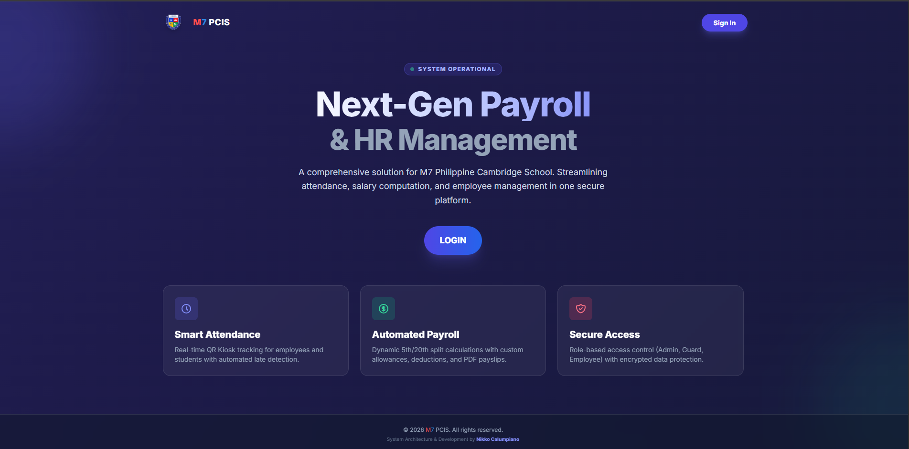

### Login Page
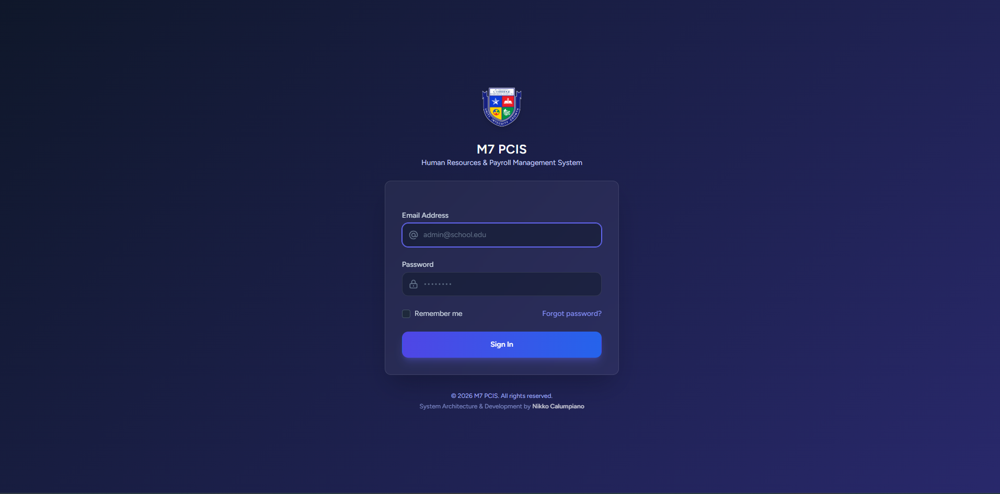

### Dashboard
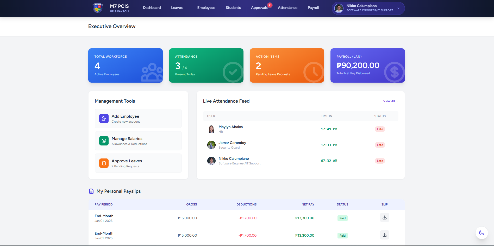

### Leave Management
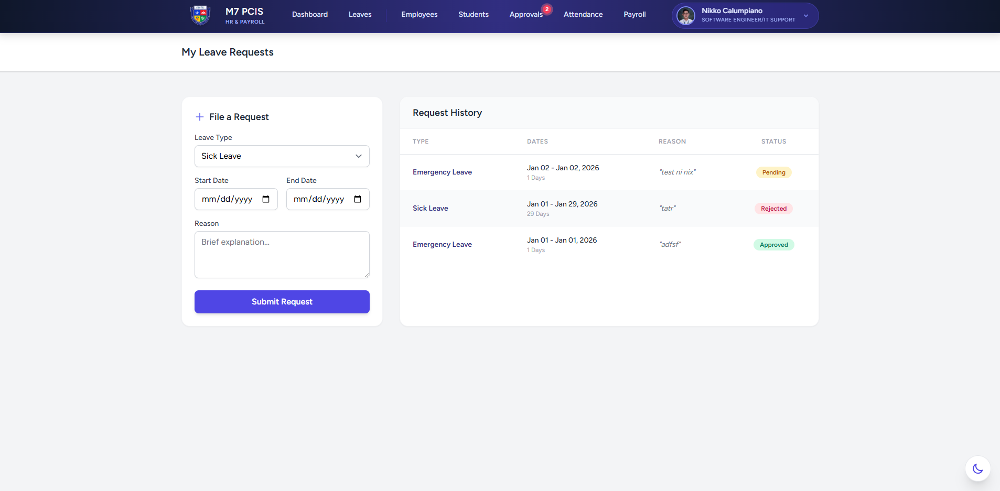

### Employee Management
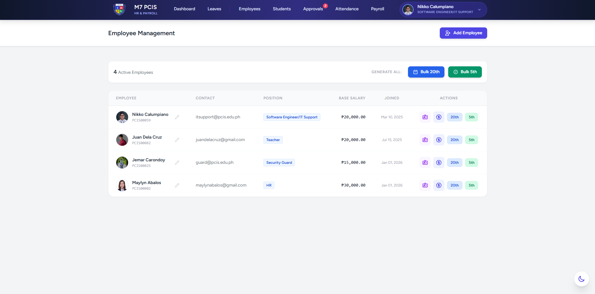

### Student Management
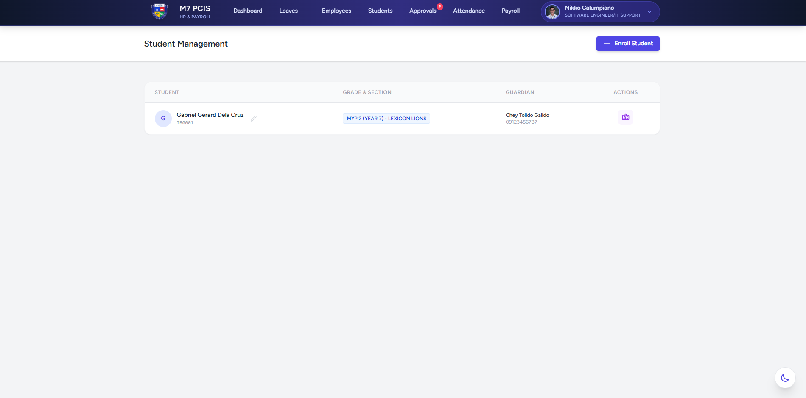

### Approvals
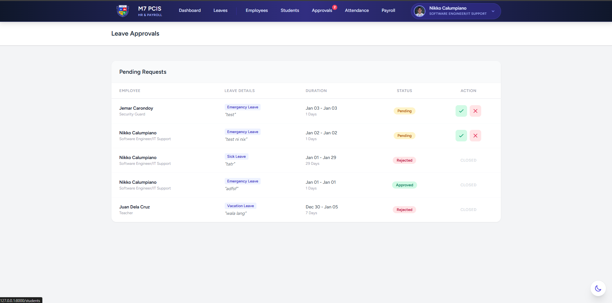

### Attendance Management
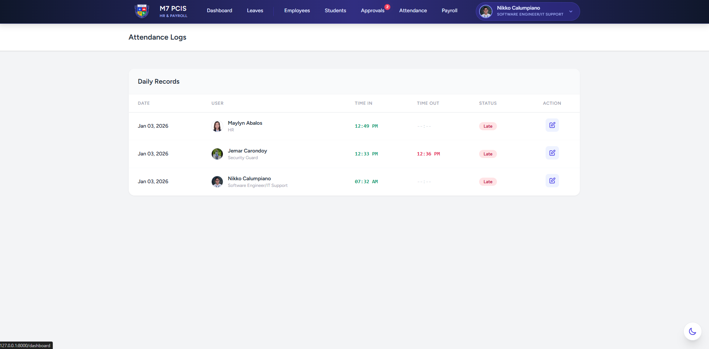

### Payroll Processing
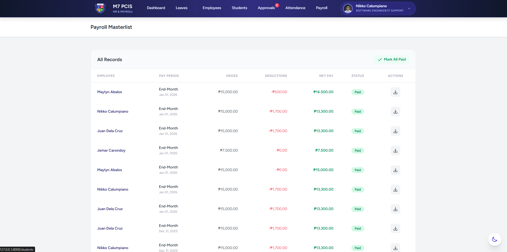

### Profile Management
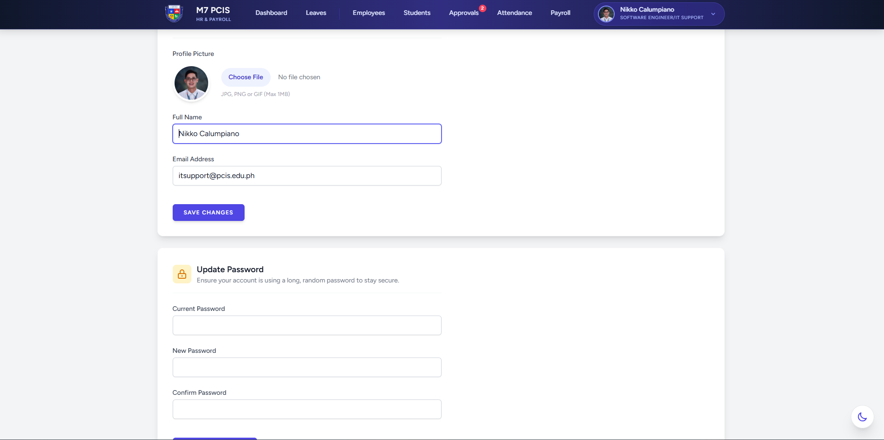

### Payslip Generation
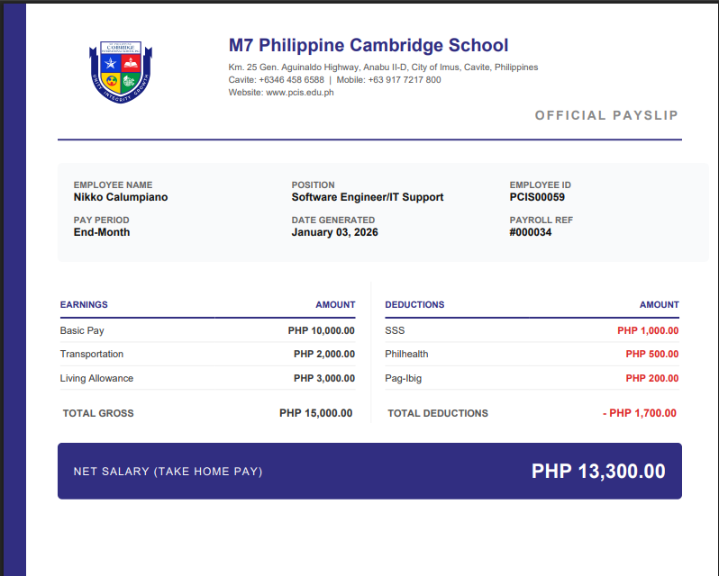


